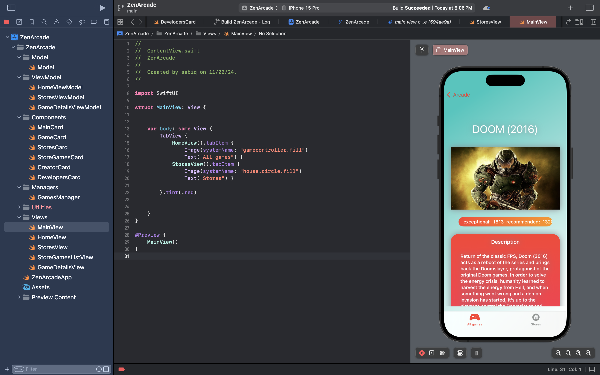

**Game Details App**

**Description:**
The Game Details App is an application developed using SwiftUI and MVVM architecture. It provides users with a platform to explore information about games, including images, developers, creators, stores, game details, and ratings. The app utilizes the RAWG.io API to fetch and display this data, offering users a comprehensive experience in discovering and learning about various games.

**Features:**
1. View detailed information about games.
2. Explore images related to games.
3. Discover developers and creators associated with games.
4. Browse stores where games are available.
5. Access game details such as release date, genre, platform, and more.
6. Check ratings and reviews for games.

**Configuration:**
1. Sign up for an account on RAWG.io and obtain an API key.
2. Replace the placeholder API key in the project with your own API key.

**Usage:**
1. Launch the app on your iOS device or simulator.
2. Browse through the list of games or search for specific titles.
3. Tap on a game to view its details, images, developers, creators, stores, and ratings.

**Credits:**

- Data provided by RAWG.io API.

